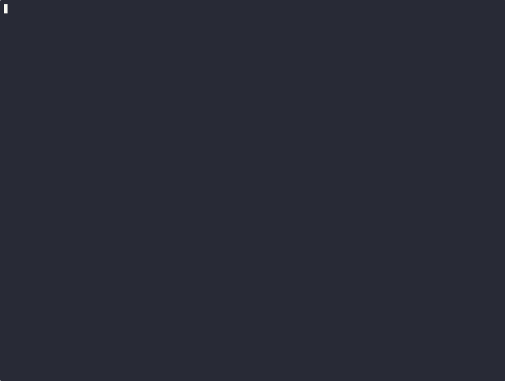

# asciinema

Asciinema official documents.

- <https://docs.asciinema.org/>
- <https://github.com/asciinema/asciinema>

## Remote file

<script async id="asciicast-569727" src="https://asciinema.org/a/569727.js"></script>

Add custom css like below to adjust terminal size.

```css
.asciicast {
    max-width: 50%;
}
```

## Local file

Use asciinema player.

- <https://docs.asciinema.org/getting-started/>
- <https://github.com/asciinema/asciinema-player/releases>

**Note: this cannot be used with i18n otherwise `demo.cast` and `demo.<lang>.cast` are prepared.**

<div id="demo"></div>
<script>
document.addEventListener("DOMContentLoaded", function () {
  AsciinemaPlayer.create('demo.cast', document.getElementById('demo'));
});
</script>

## Gif

Follow the <https://docs.asciinema.org/manual/agg/> to create gif.


